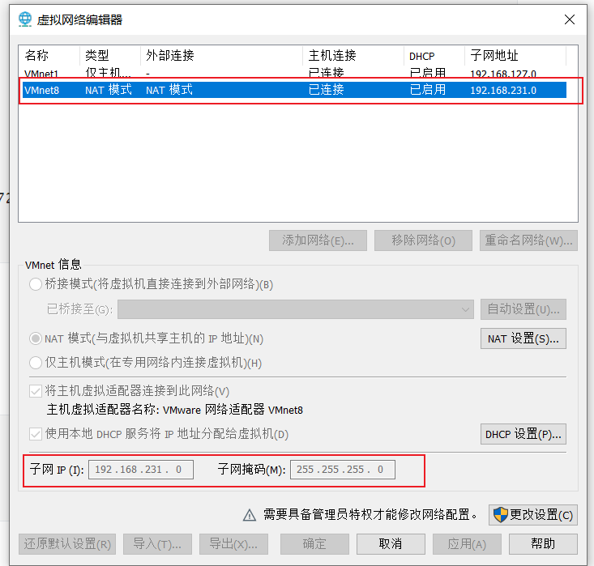
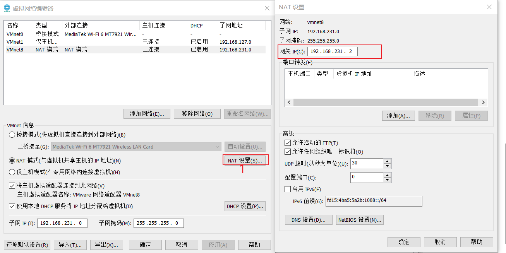
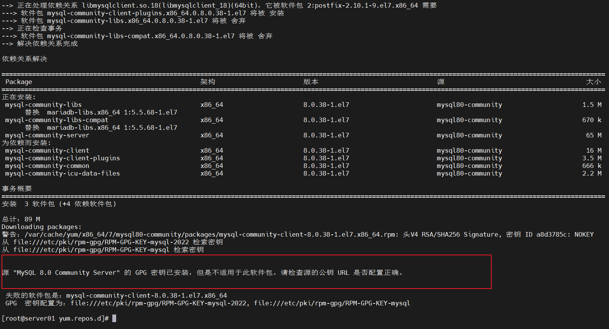

## 项目大致

## 移动端

## 管理端

## 技术框架

vue3 +springboot3 前后端分离项目。

技术要求

前端

* vue3
* nginx

后端

* Springboot
* SpringMvc
* Mybatis +Mybatis Plus

存储

* mysql
* Mino
* redis

## 数据库设计

详见lease.sql	

1. 创建数据库

```sql
CREATE DATABASE lease CHARACTER SET utf8mb4 COLLATE utf8mb4_general_ci;
```

2. **导入数据库脚本**

   将资料中的`lease.sql`脚本导入`lease`数据库，其中包含了建表语句和少量的原始数据。

## 开发环境

* centos7

  * 静态ip

    * NAT模式下，虚拟机的IP地址，默认情况下是由虚拟DHCP服务自动分配的，虚拟机的IP地址不固定，这对于SSH远程访问也不友好，所以通常情况下，我们不使用虚拟DHCP服务，而是手动为虚拟机配置静态的IP地址。具体操作如下。

      * 确定网络配置文件

        在终端输入如下命令`ifconfig`命令，查看当前的网络接口，其中ens33是目前的以太网接口，故其配置文件为`vim /etc/sysconfig/network-scripts/ifcfg-ens33`。

      * 修改配置文件

        * ```shell
          TYPE=Ethernet
          PROXY_METHOD=none
          BROWSER_ONLY=no
          BOOTPROTO=dhcp
          DEFROUTE=yes
          IPV4_FAILURE_FATAL=no
          IPV6INIT=yes
          IPV6_AUTOCONF=yes
          IPV6_DEFROUTE=yes
          IPV6_FAILURE_FATAL=no
          IPV6_ADDR_GEN_MODE=stable-privacy
          NAME=ens33
          UUID=bf788989-e095-4e58-865a-e6b07248a514
          DEVICE=ens33
          ONBOOT=yes
          ```

        * 需要修改的内容如下

          - 修改`BOOTPROTO`参数为`static`

          - 修改`ONBOOT`参数为`yes`

          - 增加如下内容

          - ```shell
            IPADDR=192.168.10.100
            NETMASK=255.255.255.0
            GATEWAY=192.168.10.2
            DNS1=192.168.10.2
            ```

            

            在子网ip的范围选择一个没使用的ip给centos7。

            

            网关ip，充当dns1。

  * 关闭防火墙

    * ```shell
      #关闭防火墙 
      systemctl stop firewalld
      
      #禁止防火墙开机自启
      systemctl disable firewalld
      ```

      

  * 关闭selinux

    * SELinux，全称为Security-Enhanced Linux，是一种用于Linux操作系统的安全增强功能，为保证后序部署阶段的Nginx能够正常工作，此处关闭SELinux功能。
    * 修改seliunx配置文件
      * 打开配置文件  vim /etc/selinux/config
      * 修改内容如下  SELINUX=disabled
      * 重启 

* 部署mysql

  * **安装MySQL yum库**

    - **下载yum库**

      下载地址为https://dev.mysql.com/downloads/repo/yum/。需要根据操作系统选择相应版本，Centos7需选择`mysql80-community-release-el7-9.noarch.rpm`。

      执行以下命令可直接下载到服务器

      ```bash
      wget https://dev.mysql.com/get/mysql80-community-release-el7-9.noarch.rpm
      ```

     - **安装yum库**

       在上述`rpm`文件所在路径执行如下命令

       ```bash
       rpm -ivh mysql80-community-release-el7-9.noarch.rpm
       ```

     - **配置国内镜像**

       修改`/etc/yum.repo.d/mysql-community.repo`文件中的`[mysql80-community]`中的`baseUrl`参数，修改内容如下：

       ```ini
       [mysql80-community]
       name=MySQL 8.0 Community Server
       baseurl=https://mirrors.tuna.tsinghua.edu.cn/mysql/yum/mysql-8.0-community-el7-$basearch/
       enabled=1
       gpgcheck=1
       gpgkey=file:///etc/pki/rpm-gpg/RPM-GPG-KEY-mysql-2022
              file:///etc/pki/rpm-gpg/RPM-GPG-KEY-mysql
       ```


  2. **安装MySQL**

     执行如下命令安装MySQL

     ```bash
     yum install -y mysql-community-server
     ```

     # 报错

     

     改用,原因是centos7不维护了 和mysql8 不匹配

     ```shell
     yum install mysql-server --nogpgcheck
     ```

     

  3. **启动MySQL**

     执行如下命令启动MySQL服务

       ```bash
     systemctl start mysqld
       ```

       执行以下命令查看MySQL运行状态

       ```bash
     systemctl status mysqld
       ```


  4. **root用户相关配置**

     - **查看root用户初始密码**

       MySQL启动后会将root用户的初始密码写入日志，通过以下命令可以获取密码

       ```bash
       cat /var/log/mysqld.log | grep password
       ```

      - **使用初始密码登录**

        执行以下命令登录MySQL

        ```bash
        mysql -uroot -p'password'
        ```

     - **修改root用户密码**

       ```bash
       alter user 'root'@'localhost' identified by 'Ls021223.';
       ```

       **注意**：MySQL默认安装了[validate_password](https://dev.mysql.com/doc/refman/8.0/en/validate-password.html) 插件，默认情况下，要求密码要包含大写字母、小写字母、数字和特殊符号，且密码长度最小为8。若需设置简单密码，可禁用该插件，或调整该插件的密码强度级别。

     - **授予root用户远程登录权限**

       ```bash
       CREATE USER 'root'@'%' IDENTIFIED BY 'Ls021223.';
       GRANT ALL PRIVILEGES ON *.* TO 'root'@'%' WITH GRANT OPTION;
       FLUSH PRIVILEGES;
       ```

*  部署redis

  * 1.安装redis

    * 下载redis所在yum仓库

      * Redis所在的仓库为**remi-release**，下载地址为：http://rpms.famillecollet.com/enterprise/remi-release-7.rpm，可使用如下命令直接下载到服务器 

        * ```shell
          wget http://rpms.famillecollet.com/enterprise/remi-release-7.rpm
          ```

          

      * **安装yum仓库**

        执行如下命令进行安装

        ```shell
        rpm -ivh remi-release-7.rpm
        ```

    * 安装redis

      ```shell
         yum --enablerepo=remi -y install redis-7.2.5
      ```

  * 2.配置redis远程访问

    * Redis服务默认只允许本地访问，若需要进行远程访问，需要做出以下配置

      * ```shell
        vim /etc/redis/redis.conf
        ```

        修改如下

      * ```shell
        #监听所有网络接口，默认只监听localhost
        bind 0.0.0.0
        
        #关闭保护模式，默认开启。开始保护模式后，远程访问必须进行认证后才能访问。
        protected-mode no
        ```

  * 3. 启动redis

       ```shell
       systemctl start redis
       systemctl status redis
       systemctl enable redis
       ```

       

* 部署minio

  * 获取安装包

    * 下载地址如下：https://dl.min.io/server/minio/release/linux-amd64/archive/minio-20230809233022.0.0.x86_64.rpm，通过以下命令可直接将安装包下载至服务器

    * ```shell
      wget https://dl.min.io/server/minio/release/linux-amd64/archive/minio-20230809233022.0.0.x86_64.rpm
      ```

  * 安装Minio

    * ```shell
      rpm -ivh minio-20230809233022.0.0.x86_64.rpm
      ```

  * 启动Minio 看看有没有安装成功

    * ```shell
      minio server ./test
      ```

  * **集成Systemd**

    * **Systemd概述**

      `Systemd`是一个广泛应用于Linux系统的系统初始化和服务管理器，其可以管理系统中的各种服务和进程，包括启动、停止和重启服务，除此之外，其还可以监测各服务的运行状态，并在服务异常退出时，自动拉起服务，以保证服务的稳定性。系统自带的防火墙服务`firewalld`，我们自己安装的`mysqld`和`redis`均是由`Systemd`进行管理的，此处将MinIO服务也交给Systemd管理。

    * **编写MinIO服务配置文件**

      Systemd所管理的服务需要由一个配置文件进行描述，这些配置文件均位于`/etc/systemd/system/`或者`/usr/lib/systemd/system/`（redis和myql）目录下，下面创建MinIO服务的配置文件。

      执行以下命令创建并打开`minio.service`文件

      ```shell
      vim /etc/systemd/system/minio.service
      ```

      内容如下，具体可参考MinIO[官方文档](https://min.io/docs/minio/linux/operations/install-deploy-manage/deploy-minio-single-node-single-drive.html#create-the-systemd-service-file)。

      ```ini
      [Unit]
      Description=MinIO
      Documentation=https://min.io/docs/minio/linux/index.html
      Wants=network-online.target
      After=network-online.target
      AssertFileIsExecutable=/usr/local/bin/minio
      
      [Service]
      WorkingDirectory=/usr/local
      ProtectProc=invisible
      EnvironmentFile=-/etc/default/minio
      ExecStartPre=/bin/bash -c "if [ -z \"${MINIO_VOLUMES}\" ]; then echo \"Variable MINIO_VOLUMES not set in /etc/default/minio\"; exit 1; fi"
      ExecStart=/usr/local/bin/minio server $MINIO_OPTS $MINIO_VOLUMES
      Restart=always
      LimitNOFILE=65536
      TasksMax=infinity
      TimeoutStopSec=infinity
      SendSIGKILL=no
      
      [Install]
      WantedBy=multi-user.target
      ```

      **注意**：

      重点关注上述文件中的以下内容即可

      - `EnvironmentFile`，该文件中可配置MinIO服务所需的各项参数
      - `ExecStart`，该参数用于配置MinIO服务的启动命令，其中`$MINIO_OPTS`、`$MINIO_VOLUMES`，均引用于`EnvironmentFile`中的变量。
        - `MINIO_OPTS`用于配置MinIO服务的启动选项，可省略不配置。
        - `MINIO_VOLUMES`用于配置MinIO服务的数据存储路径。
      - `Restart`，表示自动重启

    * **编写`EnvironmentFile`文件**

      执行以下命令创建并打开`/etc/default/minio`文件

      ```shell
      vim /etc/default/minio
      ```

      内容如下，具体可参考[官方文档](https://min.io/docs/minio/linux/operations/install-deploy-manage/deploy-minio-single-node-single-drive.html#create-the-environment-variable-file)。

      ```ini
      MINIO_ROOT_USER=minioadmin
      MINIO_ROOT_PASSWORD=minioadmin
      MINIO_VOLUMES=/data
      MINIO_OPTS="--console-address :9001"
      ```

      *注意**

      - `MINIO_ROOT_USER`和`MINIO_ROOT_PASSWORD`为用于访问MinIO的用户名和密码，**密码长度至少8位**。

      - `MINIO_VOLUMES`用于指定数据存储路径，需确保指定的路径是存在的，可执行以下命令创建该路径。

        ```bash
        mkdir /data
        ```

      - `MINIO_OPTS`中的`console-address`,用于指定管理页面的地址。

  * 启动Minio

    * ```shell
      systemctl start minio
      systemctl status minio
      systemctl enable minio
      ```

    * **访问MinIO管理页面**

      管理页面的访问地址为：`http://192.168.10.101:9001`

      **注意**：

      `ip`需要根据实际情况做出修改
  
  


# 公寓信息管理接口开发

### 房间支付方式接口开发


#### 1 查询所有的支付方式

* 由于数据做数据分析会有用，删除并不是真正的删除，做逻辑上的删除。PayMentType表有一个字段来表示是否删除。
* 查询的时候，就不要查询已经逻辑删除的数据。所以每次查询都要在sql后添加where 语句，过滤掉逻辑删除的。但是每次查询都要这样，很繁琐。可以使用mybaits-Plus 提供的逻辑删除。

**第一种方式**

​	修改配置文件如下

```yaml
mybatis-plus:
  global-config:
    db-config:
      logic-delete-field: isDeleted   #全局逻辑删除的实体字段名    除了配置文件，也可以用@TableLogic实现逻辑删除功能
      logic-delete-value: 1    #逻辑已经删除值（默认为1）
      logic-not-delete-value: 0 #逻辑未删除值（默认为0）
```

**第二种方式**

 添加注解@TableLogic 。

**tips**：

* 开启mybaits-plus 的逻辑删除后，只对自动注入的sql有效，手写的sql无效。
* 开启逻辑删除后，使用mp的删除方法，也会变成逻辑删除。delete语句，变为update语句。

#### 2 保存或者更新支付方式

 问题： 前端更新或保存数据，一般都不会填写更新时间或者保存时间。，所以这样问题可以这样解决，后端接受到前端传来的json对象，手动set时间。但是每次都set时间，很繁琐。可以使用mp的自动注入。

* 确定注入实际如下  fill的使用

```java
 @TableField(value = "create_time",fill = FieldFill.INSERT)
 private Date createTime;
```

* 确定注入什么.需要实现MetaObjectHander如下

```java
@Component
public class MybatisMetaObjectHandler implements MetaObjectHandler {
    @Override
    public void insertFill(MetaObject metaObject) {
        this.strictInsertFill(metaObject, "createTime", Date.class, new Date());

    }

    @Override
    public void updateFill(MetaObject metaObject) {
        this.strictUpdateFill(metaObject, "updateTime", Date.class, new Date());

    }
}
```

#### 3 根据id删除支付方式

* 由于开启了逻辑删除，删除操作变成了更新操作。逻辑意义上的删除。


### 房间租期管理

#### 1. 查询所有租期


注意：已经实现了逻辑删除。在查找的时候使用mp的动态sql会自动做where语句。

#### 2.保存或更新租期


注意：保存和修改

保存：前端传json对象，不传id就是保存

修改：前端传json对象，传id就是修改， 在mp代理的动态sql是先根据id查看信息，然后在update更新信息.

#### 3. 根据id删除租期


点击删除，前端获取执行的对象，传json给后端，后端用@RequestBody 接受json并变为对象。由于开启了逻辑删除，所有的删除语句就变成了更新语句.

###  标签管理


#### 1. （根据类型）查询标签列表

 类型是可选的。可以传可以不传。@RequestParam(required = false) 

传参时发现错误。


```java
 Failed to convert value of type 'java.lang.String' to required type 'com.ls.lease.model.enums.ItemType'; Failed to convert from type [java.lang.String] to type [@org.springframework.web.bind.annotation.RequestParam com.ls.lease.model.enums.ItemType] for value '1']
```

类型转化失败。String转化为ItemType类型失败

上述type参数，在数据库是tinyint，实体类中是`ItemType`枚举类型，前端中是json。

具体过程涉及类型转化如下

* **请求流程**


**说明**

- SpringMVC中的`WebDataBinder`组件负责将HTTP的请求参数绑定到Controller方法的参数，并实现参数类型的转换。
- Mybatis中的`TypeHandler`用于处理Java中的实体对象与数据库之间的数据类型转换。


* **响应流程**


**说明**

- SpringMVC中的`HTTPMessageConverter`组件负责将Controller方法的返回值（Java对象）转换为HTTP响应体中的JSON字符串，或者将请求体中的JSON字符串转换为Controller方法中的参数（Java对象），例如下一个接口**保存或更新标签信息**


下面介绍一下每个环节的类型转换原理

- **WebDataBinder枚举类型转换**

  `WebDataBinder`依赖于[`Converter`](https://docs.spring.io/spring-framework/reference/core/validation/convert.html)实现类型转换，若Controller方法声明的`@RequestParam`参数的类型不是`String`，`WebDataBinder`就会自动进行数据类型转换。SpringMVC提供了常用类型的转换器，例如`String`到`Integer`、`String`到`Date`，`String`到`Boolean`等等，其中也包括`String`到枚举类型，但是`String`到枚举类型的默认转换规则是根据实例名称（"APARTMENT"）转换为枚举对象实例（ItemType.APARTMENT）。若想实现`code`属性到枚举对象实例的转换，需要自定义`Converter`，代码如下，具体内容可参考[官方文档](https://docs.spring.io/spring-framework/reference/core/validation/convert.html#core-convert-Converter-API)。

- 自定义转换类型

  - 1. 实现Converter接口  

    ```java
    /**
     * 自定义 Converter 方式
     * 实现Converter接口 import org.springframework.core.convert.converter.Converter;
     */
    //在ioc中注册，方便使用
    @Component
    public class StringToItemType implements Converter<String,ItemType> {
    
        @Override
        public ItemType convert(String code) {
            //如果新增枚举实例就新增一个if
    //        if ("1".equals(code)){
    //            return ItemType.APARTMENT;
    //        } else if ("2".equals(code)) {
    //            return ItemType.ROOM;
    //        }
    
            //用枚举类型的静态方法，获取所有枚举类型的实例
            ItemType[] values = ItemType.values();
    
            //遍历枚举类型实例，如果枚举类型的实例的code等于参数code，就返回这个枚举实例
            for (ItemType value : values) {
                if (value.getCode().equals(Integer.valueOf(code))){
                    return value;
                }
            }
            throw new IllegalArgumentException("code:" + code  +"非法");
        }
    }
    ```

    2. 在SpringMVC中注册自定义转换类

       ```java
       @Configuration
       public class WebMvcConfiguration implements WebMvcConfigurer {
       
           //添加自定义Converter
           @Autowired
           private StringToItemType stringToItemType;
           @Override
           public void addFormatters(FormatterRegistry registry) {
               registry.addConverter(stringToItemType);
           }
       }
       
       ```

       这样WebDateBind就能够转化String到枚举。（Springmvc虽然提供了String->枚举类型，但是不能满足外面的要求，Spring提供的自动转化是根据string的内容找枚举实例，我们需要根据string的内容对应的序号获取枚举类型）。

#### 2. 更新或报错标签

#### 3. 删除标签操作

###  自定义类型转换工厂

 在标签管理中由于WebDatabind不能按照我们的要求将String 转换为枚举类，我们自定义了一个转换类。并在webmvc中注册。

但是我们有很多的枚举类型都需要考虑类型转换这个问题，按照上述思路，我们需要为每个枚举类型都定义一个Converter，并且每个Converter的转换逻辑都完全相同，针对这种情况，我们使用[`ConverterFactory`](https://docs.spring.io/spring-framework/reference/core/validation/convert.html#core-convert-ConverterFactory-SPI)接口更为合适，这个接口可以将同一个转换逻辑应用到一个接口的所有实现类，因此我们可以定义一个`BaseEnum`接口，然后另所有的枚举类都实现该接口，然后就可以自定义`ConverterFactory`，集中编写各枚举类的转换逻辑了。具体实现如下：

```java
public interface BaseEnum {
    Integer getCode();
    String getName();
}
```

```java
@Component
public class StringToBaseEnumConverterFactory implements ConverterFactory<String, BaseEnum> {
    @Override
    public <T extends BaseEnum> Converter<String, T> getConverter(Class<T> targetType) {
        return new Converter<String, T>() {
            @Override
            public T convert(String source) {

                for (T enumConstant : targetType.getEnumConstants()) {
                    if (enumConstant.getCode().equals(Integer.valueOf(source))) {
                        return enumConstant;
                    }
                }
                throw new IllegalArgumentException("非法的枚举值:" + source);
            }
        };
    }
}
```

### **TypeHandler枚举类型转换**

Mybatis预置的`TypeHandler`可以处理常用的数据类型转换，例如`String`、`Integer`、`Date`等等，其中也包含枚举类型，但是枚举类型的默认转换规则是枚举对象实例（ItemType.APARTMENT）和实例名称（"APARTMENT"）相互映射。若想实现`code`属性到枚举对象实例的相互映射，需要自定义`TypeHandler`。

不过MybatisPlus提供了一个[通用的处理枚举类型的TypeHandler](https://baomidou.com/pages/8390a4/)。其使用十分简单，只需在`ItemType`枚举类的`code`属性上增加一个注解`@EnumValue`，Mybatis-Plus便可完成从`ItemType`对象到`code`属性之间的相互映射，具体配置如下。

```java
public enum ItemType {

    APARTMENT(1, "公寓"),
    ROOM(2, "房间");

    @EnumValue
    private Integer code;
    private String name;

    ItemType(Integer code, String name) {
        this.code = code;
        this.name = name;
    }
}
```

### **HTTPMessageConverter枚举类型转换**

`HttpMessageConverter`依赖于Json序列化框架（默认使用Jackson）。其对枚举类型的默认处理规则也是枚举对象实例（ItemType.APARTMENT）和实例名称（"APARTMENT"）相互映射。不过其提供了一个注解`@JsonValue`，同样只需在`ItemType`枚举类的`code`属性上增加一个注解`@JsonValue`，Jackson便可完成从`ItemType`对象到`code`属性之间的互相映射。具体配置如下，详细信息可参考Jackson[官方文档](https://fasterxml.github.io/jackson-annotations/javadoc/2.8/com/fasterxml/jackson/annotation/JsonValue.html)。

```java
public enum ItemType {

    APARTMENT(1, "公寓"),
    ROOM(2, "房间");

    @EnumValue
  	@JsonValue
    private Integer code;
    private String name;

    ItemType(Integer code, String name) {
        this.code = code;
        this.name = name;
    }
}
```

### 为什么使用枚举后，类型转换这么多麻烦还要用枚举，而不直接用integer表示状态。

1. **类型安全**：
   使用枚举类型可以确保状态的取值只能是预定义的值之一，这避免了使用整数时可能出现的错误值。例如，如果你使用整数来表示订单的状态（如1表示待支付，2表示已支付），那么代码中的任何错误都可能导致使用无效的整数值（如3或-1），这可能会导致运行时错误或逻辑错误。而枚举类型强制类型安全，确保状态值只能是定义好的那几个。
2. **清晰易读**：
   枚举类型的命名通常比整数更具描述性，使得代码更加清晰易懂。例如，使用`OrderStatus.PENDING_PAYMENT`比使用整数`1`来表示待支付状态要直观得多。这不仅提高了代码的可读性，也方便了团队成员之间的理解和协作。
3. **易于扩展和维护**：
   随着业务逻辑的发展，可能需要添加新的状态或修改现有状态。使用枚举类型可以很容易地通过添加新的枚举常量或修改现有常量来实现，而不需要修改大量使用这些状态的代码。相比之下，如果使用整数表示状态，则可能需要在多处代码中更新状态值，这既繁琐又容易出错。
4. **支持方法和属性**：
   枚举类型可以包含方法和属性，这使得它们能够包含比简单整数更多的信息。例如，你可以为每个枚举常量添加一个描述性字符串，或者定义一个方法来获取与该状态相关的特定信息。这些功能对于表示复杂的状态逻辑非常有用。
5. **支持`switch`语句**：
   在Java中，使用枚举类型作为`switch`语句的表达式可以使代码更加清晰和易于维护。从Java 7开始，`switch`语句还支持字符串，但枚举类型通常仍然是更好的选择，因为它们提供了更强的类型安全性和更清晰的语义。
6. **可序列化且单例**：
   枚举类型是自动可序列化的，并且它们的每个实例在JVM中都是唯一的（即单例）。这意味着你可以安全地将枚举类型的实例作为序列化对象传输，而无需担心它们的唯一性或序列化问题。

综上所述，使用枚举类型来表示状态是Java开发中一种更加安全、清晰、易于扩展和维护的方式。


### 配套管理开发


配套信息的开发接口。

#### 1. （根据类型）查询配套信息

#### 2. 新增或修改配套信息

#### 3.根据id删除配套信息

### 房间基本属性管理


表结构


#### 1. 查询所有属性值以及对应的属性名称。

涉及多表查询，mybaitsPlus不能满足我们的需求，就自定义sql。

controller层调用service层接口方法，service层接口方法实现（调用dao层），dao层绑定mapper.xml编写sql语句。

```xml
<?xml version="1.0" encoding="UTF-8"?>
<!DOCTYPE mapper
        PUBLIC "-//mybatis.org//DTD Mapper 3.0//EN"
        "http://mybatis.org/dtd/mybatis-3-mapper.dtd">
<mapper namespace="com.ls.lease.web.admin.mapper.AttrKeyMapper">
    <resultMap id="AttrKeyVoMap" type="com.ls.lease.web.admin.vo.attr.AttrKeyVo">
        <id property="id" column="id"/>
        <result property="name" column="name"/>
        <collection property="attrValueList" ofType="com.ls.lease.model.entity.AttrValue">
            <id property="id" column="attr_value_id"/>
            <result property="name" column="attr_value_name"/>
            <result property="attrKeyId" column="attr_key_id"/>
        </collection>

    </resultMap>

    <select id="listAttrInfo" resultMap="AttrKeyVoMap">
        select k.id,
               k.name,
               v.id attr_value_id,
               v.name attr_value_name,
               v.attr_key_id
        from attr_key k
                 join attr_value v
                      on k.id = v.attr_key_id
        where k.is_deleted = 0
          and v.is_deleted = 0;

    </select>
</mapper>
```

回顾一下：

* 两表查询，外键放在多方，一对多，多对一，看需求，本次需求显然是一对多。因为要涉及量表查询后数据的保存，所以定义了新的VO。新的Vo应该保证传给前端的json的格式{"code":xx,"msg" : xxx,"data": {}}。应主要关注于data 的格式。本次查询data应该是list（属性值）套list(属性名称)。
* 自定义sql，表的join，以及自定义映射，在自定义表的二级映射时，如果数据时集合使用collection标签。
* idea中sql语句提示，要idea连接数据库，然后在mapper.xml中简历新session。

上述代码有bug，这种情况下

​	属性值下面没有对应的属性名，join连接不会保存属性值信息，也就无法映射，在前端就收不到这个空属性名的属性值。

​	可以改用left join 连接

JOIN（内连接）

+ **基本概念**：`JOIN`（或称为内连接）会返回两个或多个表中匹配的行。如果在一个表中有行与另一个表中的行基于连接条件匹配，那么这些行会被包括在结果集中。如果某行在一个表中没有匹配的行，那么该行就不会出现在结果集中。
+ **用途**：当你只想要那些在两个或多个表中都有匹配的行时，使用 `JOIN`。

 LEFT JOIN（左连接）

+ **基本概念**：`LEFT JOIN`（或称为左外连接）会返回左表（`LEFT JOIN` 语句中指定的第一个表）的所有行，即使右表中没有匹配的行。如果右表中没有匹配的行，则结果中这些行的右表部分将包含 NULL。
+ **用途**：当你想要从左表中选择所有的行，并且仅当它们在右表中也有匹配时，才选择右表中的行，这时可以使用 `LEFT JOIN`。这常用于想要保留左表中的所有记录，同时获取与右表匹配的信息（如果有的话）的场景。

发现还是不能显示k的数据（k对应v为空）。left join 会保存左表的所有，那么为什么会没有呢？

​	这是因为我们使用了逻辑删除，sql语句的后的过滤条件，

```sql
where k.is_deleted = 0
          and v.is_deleted = 0;
```

由于右边对应左表的值时空的，即右表中没有匹配的行，则结果中这些行的右表部分将包含 NULL。就不满足逻辑删除的v.is_deleted = 0的条件，自然就没有该数据。

一般我们对于使用逻辑删除，left join 的连接，过滤条件发生变化，将 v.is_deleted = 0。移动到表连接的过程，如下。

```sql
 select k.id,
               k.name,
               v.id attr_value_id,
               v.name attr_value_name,
               v.attr_key_id
        from attr_key k
                left join attr_value v
                      on k.id = v.attr_key_id  and v.is_deleted = 0
        where k.is_deleted = 0
```


#### 2. 保存或更新属性值

#### 3. 保存或更新属性名

#### 4. 根据id删除属性名

删除属性名的同时，应该删除属性名下所有的属性值

#### 5. 根据id删除属性

### 杂费信息管理


对应的表


#### 1. 查询所有的杂费名称，以及对应的杂费值

实体对象设计：返回杂费名的集合，杂费名的集合中包含杂费值的集合。可以为这个对象设计个新类型，表示多表查询的结果接收类。

该表只需继承杂费名，添加list<杂费值>即可。

业务实现：mybatisplus不能实现多表查询，只能自定义sql。controller层调用service接口方法，serviceimp负责实现，serviceimp中调用dao层方法。在对应的mapper.xml文件编写sql。编写sql的时候注意逻辑删除。

#### 2. 更新或保存杂费名

#### 3. 更新或保存杂费值

#### 4. 根据id删除杂费名

 删除杂费名的同时删除杂费名对应的杂费值

#### 5. 根据id删除属性值


### 地区信息管理


#### 1. 查询省份信息

#### 2. 根据省份id查询城市id

#### 3. 根据城市id查询区域信息


### 图片上传管理

**1. 图片上传流程**

下图展示了新增房间或公寓时，上传图片的流程。


2. 配置Minio 

   1. 引入Minio Maven依赖

      ```xml
      <dependency>
          <groupId>io.minio</groupId>
          <artifactId>minio</artifactId>
      </dependency>
      ```

   2. 配置Minio相关参数

   在`application.yml`中配置Minio的`endpoint`、`accessKey`、`secretKey`、`bucketName`等参数

   ```yaml
   minio:
     endpoint: http://<hostname>:<port>
     access-key: <access-key>
     secret-key: <secret-key>
     bucket-name: <bucket-name>
   ```

   3. 创建配置参数类,（也可以直接用@Value注入）

   ```java
   /**
    * 配置参数类
    * @ConfigurationProperties(prefix = "minio")
    * 根据类的属性自动映射，yaml文件中minio下的属性值。
    * 注意要在在配置类上注册
    *
    */
   
   @Data
   @ConfigurationProperties(prefix = "minio")
   public class MinioProperties{
        private String endpoint;
        private String accessKey;
        private String secretKey;
   
        private String bucketName;
   
   }
   
   ```

   4. 创建配置类

   ```java
   @Configuration
   //@EnableConfigurationProperties(MinioProperties.class) //注册
   @ConfigurationPropertiesScan("com.ls.lease.common.minio")  //注册 配置参数类
   public class MinioConfiguration {
   
       @Autowired
       private MinioProperties minioProperties;
       @Bean
       public MinioClient minioClient(){
           MinioClient minioClient = MinioClient.builder()
                   .endpoint(minioProperties.getEndpoint())
                   .credentials(minioProperties.getAccessKey(), minioProperties.getAccessKey())
                   .build();
   
           return minioClient;
       }
   }
   ```

   至此minio配置完成。

   上传图片实现。

   controller层调用service接口，接口实现逻辑。

   编写service代码

   ```java
   /**
    * 图片上传业务
    */
   @Service
   public class FileServiceImpl implements FileService {
       @Autowired
       private MinioClient minioClient;
       @Autowired
       private MinioProperties properties;
   
       @Override
       public String upload(MultipartFile file) {
           try {
               //判断桶是否存在
               boolean bucketExists = minioClient.bucketExists(BucketExistsArgs.builder()
                       .bucket(properties.getBucketName())
                       .build()
               );
   
               if (!bucketExists) {
                   //创建桶
                   minioClient.makeBucket(MakeBucketArgs.builder()
                           .bucket(properties.getBucketName())
                           .build()
                   );
                   //设置桶的访问权限
                   minioClient.setBucketPolicy(SetBucketPolicyArgs.builder()
                           .bucket(properties.getBucketName())
                           .config(createBucketPolicyConfig(properties.getBucketName()))
                           .build());
               }
   //            minioClient.uploadObject() 上传本地图片
               //设置文件名
               String filename = new SimpleDateFormat("yyyyMMdd").format(new Date()) + "/" + UUID.randomUUID() + "-" + file.getOriginalFilename();
               //上传文件
               minioClient.putObject(PutObjectArgs.builder()
                       .bucket(properties.getBucketName())
                       .stream(file.getInputStream(), file.getSize(), -1)
                       .object(filename)
                       .contentType(file.getContentType())//设置响应体，内容类型，不然这种处理方式时字符流，浏览器访问字符流的文件会下载，而不是查看。
                       .build()
               );
               //拼接url
   //            String url = properties.getEndpoint() +"/"+properties.getBucketName()+"/"+filename;
               String url = String.join("/", properties.getEndpoint(), properties.getBucketName(), filename);
   
               return url;
           } catch (Exception e) {
               e.printStackTrace();
           }
           return null;
       }
   
       private String createBucketPolicyConfig(String bucketName) {
   
           return """
                   {
                     "Statement" : [ {
                       "Action" : "s3:GetObject",
                       "Effect" : "Allow",
                       "Principal" : "*",
                       "Resource" : "arn:aws:s3:::%s/*"
                     } ],
                     "Version" : "2012-10-17"
                   }
                   """.formatted(bucketName);
       }
   }
   ```

   需要注意的是：

   * 设置响应体，内容类型，不然这种处理方式时字符流，浏览器访问字符流的文件会下载，而不是查看。

   ​	

   处理异常的巧妙的解决办法：try{}catch(){}

   * 在处理异常时，我们可以将service层的异常全部抛出在controller解决，try{}catch(){},捕获所有异常返回失败就行。而不是根据service的返回结果判断是否出现异常。
   * 如下例子

   ```java
   @Tag(name = "文件管理")
   @RequestMapping("/admin/file")
   @RestController
   public class FileUploadController {
   
       @Autowired
       private FileService fileService;
   
       @Operation(summary = "上传文件")
       @PostMapping("/upload")
       public Result<String> upload(@RequestParam MultipartFile file) {
           try {
               String url = fileService.upload(file);
               return Result.ok(url);
           } catch (Exception e) {
               return Result.fail();
           }
       }
   }
   ```

   